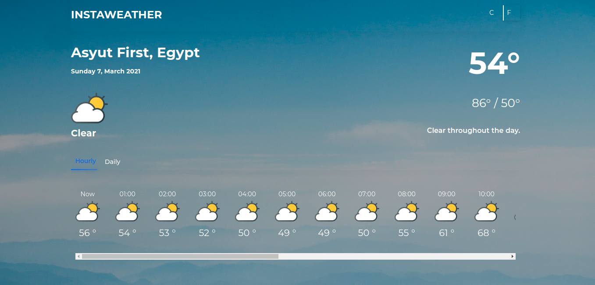

# weather-app

#  Getting start

Weather App is Web application that displays the current temperature, next 24 hours and daily weather forecast based on user loaction.

# Installation
- Create `.env` file and fill variables

    `VUE_APP_API_URL
    VUE_APP_GOOGLE_MAPS_API_KEY
    VUE_APP_DARKSKY_API_KEY`
    
    VUE_APP_GOOGLE_MAPS_API_KEY to get city name.
- Install NPM: `npm install`
- visit https://cors-anywhere.herokuapp.com/corsdemo and `request access`.
- Run : `npm run serve`
